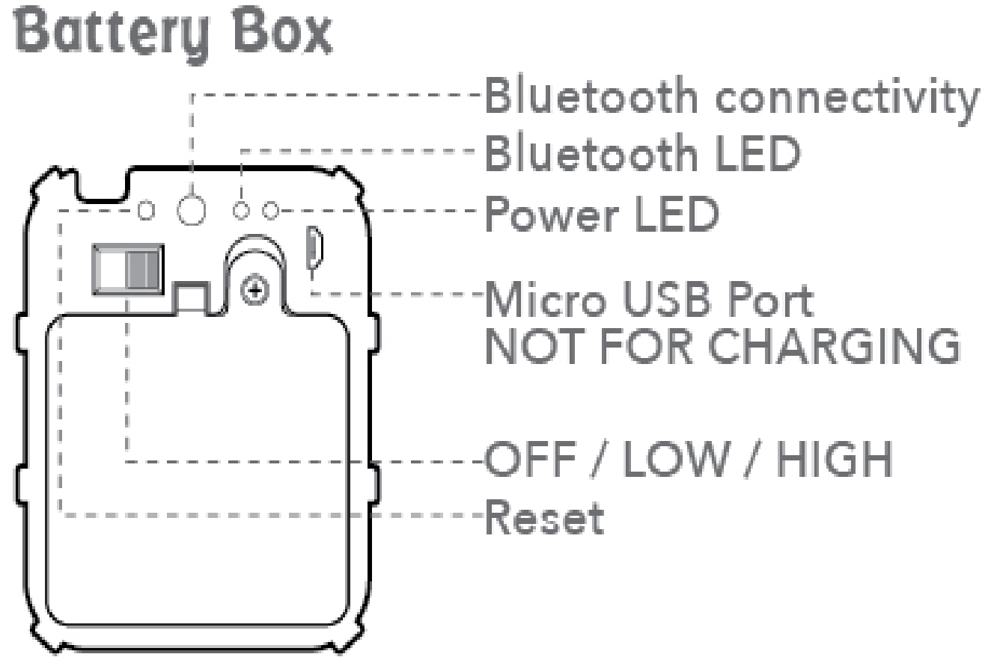
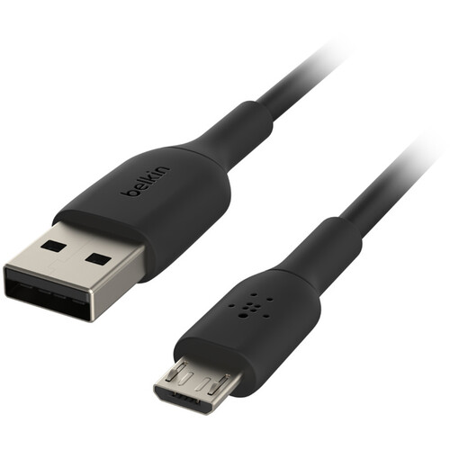
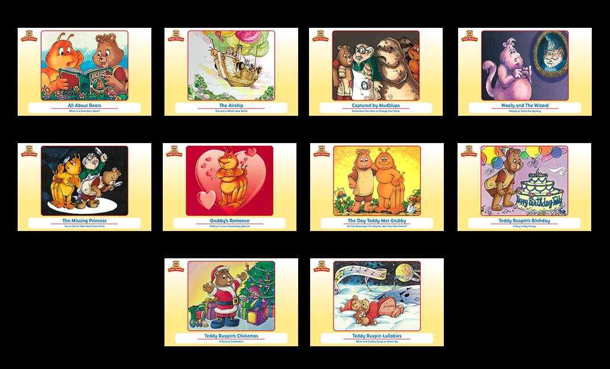
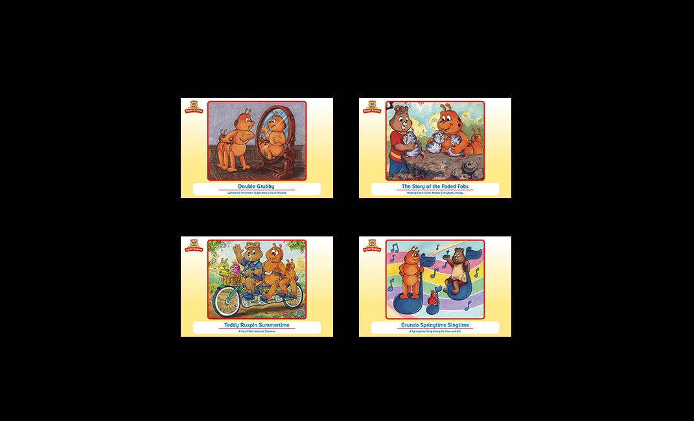
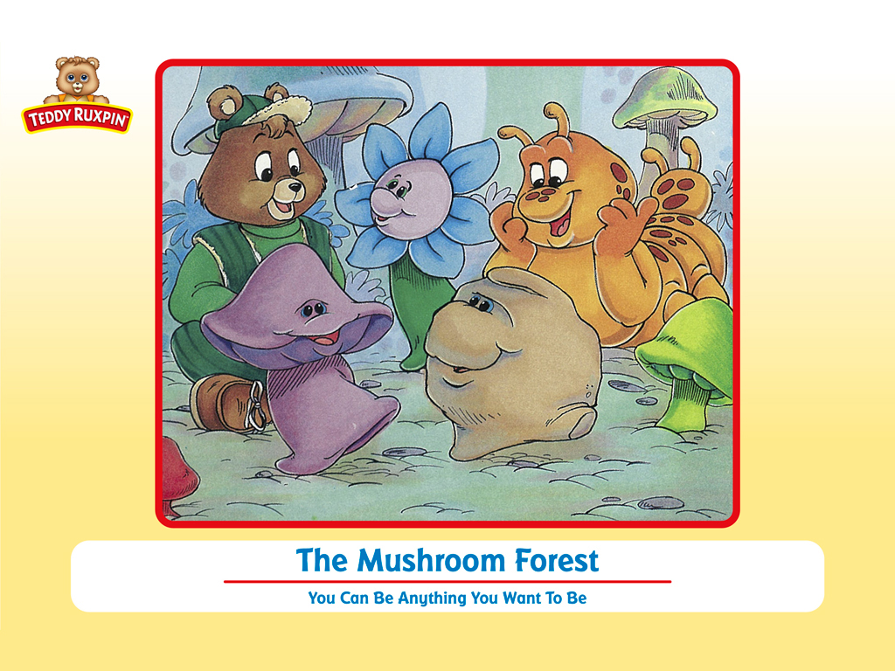
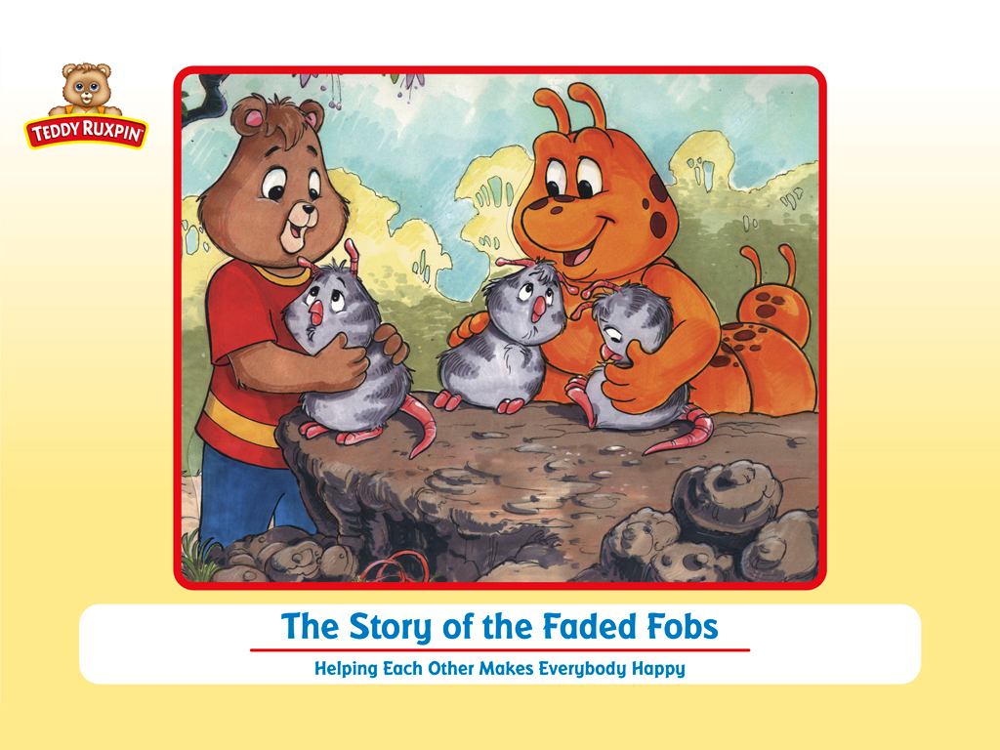
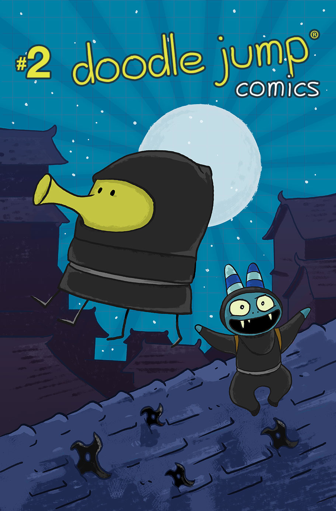

#  welcome to teddy-ruxuments!
a documentation of the 2017 teddy ruxpin app, and some of the toy! see the pun though? (ruxpin + documents) "Teddy Ruxuments". it's me being silly lol :P

# these are the stories with the hex codes to unlock them
please use NRF connect, press the bluetooth button on the back of teddy, then connect teddy to NRF connect. his bluetooth name will be "TeddyRuxpin-N351" or something similar. once connected to teddy, tap on the unknown service at the bottom (UUID:a08d...f4) then tap to "unknown characteristic" (the one with the up arrow) and click the up arrow icon, then you'll see "new value", enter the app mode hex which is listed here:

enter app mode: AA020C00F2 (this is used to actually be able to send the hex codes to unlock the stories, it makes teddy think he's connected to the app)

  

# main firmware stories:

send whatever story hex you want teddy to have using the same technique you used to send the app mode hex (story13 coicidentally was correct, i just guessed it)

story 1 (all about bears): AA03110001EB

story 2 (the airship): AA03110002EA

story 3 (captured by mudblubs/mudblups): AA03110003E9

story 4 (wooly and the wizard): AA03110004E8

story 5 (the missing princess): AA03110005E7

story 6 (grubby's romance): AA03110006E6

story 7 (the day teddy met grubby): AA03110007E5

story 8 (Teddy's birthday) AA03110008E4

story 9 (teddy ruxpin's Christmas): AA03110009E3

story 10 (Teddy Ruxpin lullabies): AA0311000AE2

# download-only (these are listed on the app, but there's no story bin to go along with them, you have to download them to teddy)

download to the stories are [here](https://www.mediafire.com/folder/fnvah5x8qwunw/Teddy+ruxpin+last+four+stories), or if you want all stories, they are  [here](https://drive.google.com/file/d/1tKOWU6dnWm_NVEJGMClyj4VrAovs4q7f/view)

story 11 (double grubby): AA0311000BE1

story 12 (the story of the faded fobs): AA0311000CE0

story 13 (The mushroom forest): AA0311000DDF (FOUND HEX! but the bin file doesn't exist... or does it?)

story 14 (summertime): AA0311000EDE

story 15 (springtime singtime): AA0311000FDD

final hex: exit app mode: AA020D00F1 (use this to make teddy interactable again) then disconnect teddy and listen to your newly unlocked stories!

# custom-only stories
these unlock the slots for the stories, then you have quite a bit of slots to put custom stories in

story16: AA03110010DC

story17: AA03110011DB

story18: AA03110012DA

story19: AA03110013D9

story20: AA03110014D8

Story13 is now in the works!

# but how to download the extra stories to Teddy?
use a cord like this: ... plug it into your pc, and into teddy, a new drive will appear, then find a folder called "books" then add story11.bin, story12.bin, story14.bin and story15.bin, if you did everything correctly, there should be four new stories that don't have an intro. if they don't play, redo the hex codes for them, if they still don't play check the SOURCE:
here is the [SOURCE](https://www.reddit.com/r/teddyruxpin/comments/romz7g/story_bins/)

# proof of story13 existing and being the mushroom forest
tell me if you notice the mushroom forest anywhere on these two photos. (these are from the apk/the swf file)

 

no? well this is the mushroom forest's photo (found in the apk/swf file):

# the app
i was looking in the apk, and i found a flash file! it's really just assets. the images inside that file are in the images folder on this repo
and appearently, the story of the faded fobs uses YeS! entertainment art. also, the app is still available on apkpure, really any app that is discontinued is still on apkpure. [here](https://d.apkpure.com/b/XAPK/air.com.animangaplus.TeddyRuxpin?versionCode=1000038) is a download link, click it to download the xapk, or if for some reason you don't trust me, go to [the apkpure page](https://apkpure.com/teddy-ruxpin/air.com.animangaplus.TeddyRuxpin/download)

# leftovers/oddities
there are default flash assets inside both the .obb and apk, for example there's the main character from "Doodle-Jump" 
 
it's really strange, but kind of cool when you really think about it

your probably wondering why the entire repo seems.. off, it's because i accidentally ruined the original repo, so i had to reconstruct it here :(

# modding teddy
to mod teddy's stories (making custom stories) please have a look at the [adafruit thingy](https://blog.adafruit.com/2023/08/23/tutorial-teddy-ruxpin-rebuild-hack-your-teddy-with-personalization/), you can make custom stories with custom audio and animations. there's also [this](https://github.com/dglaude/ruxalyzer-for-teddy-ruxpin/tree/main), there's many things, all i know is the .bin files are compressed with SNXROM (or something like that), there's [this aswell!](https://www.hackster.io/news/adafruit-hacks-a-teddy-ruxpin-for-fun-and-profit-and-creepy-glowing-logo-eyes-a4597d7c20de), there's [this](https://cdn-learn.adafruit.com/downloads/pdf/teddy-ruxpin-rebuild.pdf) too. please don't use these if you don't know what your doing!!

to make custom outfits, you can give teddy a new jacket/vest by buying one or making one. you will have to cut a little thread that holds the vest on teddy

to make teddy a new toy completely, you can give him a new body by making a plush toy with eyeholes, and a mouth or mouthhole, you will have to sacrifice a teddy for this. a lady on youtube did a video on taking apart teddy which is [here](https://www.youtube.com/watch?v=eejZZ6dyo1Q) however BE CAREFUL with teddy!

BUT WARNING! IF YOU BREAK TEDDY, IT WILL VOID THE WARRANTY!

# Test mode on the 2017 teddy
to enter test mode, you have to (somehow) turn on teddy, then very quickly push all three main buttons (the two paws, and the skip story button)
to navigate test mode, use teddy's right paw, to start a test, press teddy's left paw. i haven't yet tested the patch button/the button on teddy's chest in test mode.

modes:

mouth cal test (most likely stands for mouth calibration test): this makes teddy's mouth open and close

LCD test: this makes teddy's LCDs show colors, it's similar to the furby connect's LCD test mode

demo song: this makes teddy sing/tell the story "all about bears" when his left paw is pressed

button test: this tests the three buttons on teddy, it also shows weird versions of teddy's eyes on the screen

motor test, does what you think it does, tests the mouth motor

book test: shows you exactly what stories you have unlocked and which ones are still locked, story13 will be locked, it's only a slot for a story and appearently there were originally supposed to be 20 stories, 10 pre-downloaded, and 10 downloadable, since there is story16-story20 slots, you can add your own stories in these slots, i haven't yet figured out how to do so though

usb test: this tests the usb at the back of teddy

battery test: shows you teddy's battery level when you press his left paw

bluetooth test, press teddy's left paw, this starts the test, then press the bluetooth button on the back of teddy, then you can see if teddy's bluetooth is working

sleep mode, turns teddy off when the left paw is pressed

and then thats the end of test mode!

# other
there is a [video](https://ia800907.us.archive.org/31/items/teddy-ruxpin-instructional-video/Teddy%20Ruxpin%20Instructional%20Video.mp4) that talks about "getting started, features and controls, storytelling and singing mode, interactive app play mode, expanding your digital library, and troubleshooting and tips". however the links in the video are dead and the video info is kinda outdated

i'm also going to try and recreate what story13.bin was supposed to be, i'll add it here if i can, i haven't made it yet though. i'll start it soon enough. i'm going to use that as a placeholder until i find the real story.bin file

i may also try and make the last five stories that were never released (they are unknown, story16-story20 are only slots for stories to go)

list of stories i'm going to try and make:
Story13 (the mushroom forest), story16 (teddy ruxpin's autumn adventure), story17 (teddy ruxpin's winter adventure), story18 (take a good look), story19 (grunge music) and story20 (lullabies II)

------------------------------------------------------------------------------------
